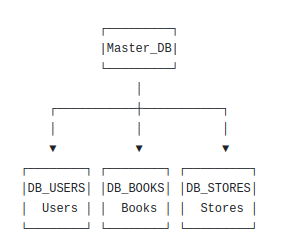

# Домашнее задание к занятию «Репликация и масштабирование. Часть 2»
### Золоторев Н.Д.

### Задание 1

Опишите основные преимущества использования масштабирования методами:

    активный master-сервер и пассивный репликационный slave-сервер;
    master-сервер и несколько slave-серверов;

Дайте ответ в свободной форме.

### Решение 1

1. Главное преимущество — отказоустойчивость. При падении master мы быстро переключаемся на slave, что минимизирует простой сервиса. Дополнительно slave служит горячим резервом для бэкапов, которые можно делать без остановки master'а.

2. Здесь добавляется горизонтальное масштабирование чтения: все SELECT-запросы распределяются между несколькими репликами, что сильно повышает общую пропускную способность системы. Кроме того, slave можно разнести по разным ЦОД для снижения задержек у пользователей, а также выделить один slave под тяжёлые отчёты, не нагружая остальные.

### Задание 2

Разработайте план для выполнения горизонтального и вертикального шаринга базы данных. База данных состоит из трёх таблиц:

    пользователи,
    книги,
    магазины (столбцы произвольно).

Опишите принципы построения системы и их разграничение или разбивку между базами данных.

Пришлите блоксхему, где и что будет располагаться. Опишите, в каких режимах будут работать сервера.

### Решение 2

Таблица пользователи разбил на две части. Первая половина строк (например, с 1 по 500) попадает в первую базу, вторая половина (501–1000) — во вторую. Таблицы книги и магазины не трогаем и остаются каждая в своей отдельной базе целиком, потому что они маленькие или редко запрашиваются. Каждый из четырёх серверов работает в режиме Master. Это значит, что каждый сам отвечает за свою порцию данных — принимает запросы, пишет, читает, ничего никому не пересылает.

2. Каждая таблица живёт на своей собственной базе данных, расположенной на отдельном    сервере. Базы данных никак не связаны друг с другом и не знают о существовании соседей. Приложение само знает, в какую базу идти за нужными данными, и при необходимости собирает информацию из нескольких баз по очереди.

            
 